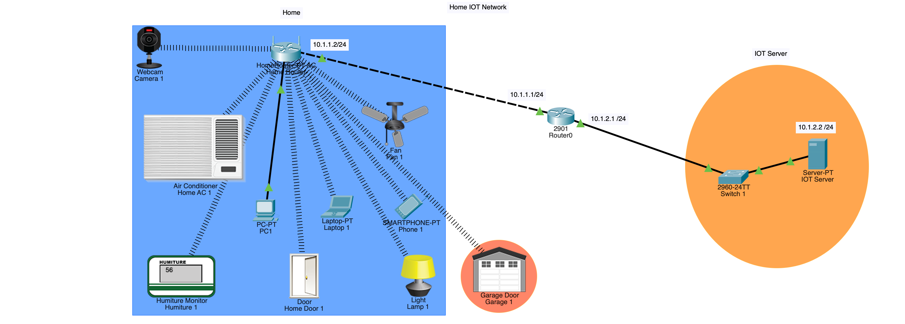

# 🏠 Home-IoT-Network-Project

This project demonstrates the design and configuration of a **Home IoT Network** integrated with an **IoT Server**, enabling centralized control and monitoring of smart home devices. The network is built and simulated in **Cisco Packet Tracer**, illustrating how IoT devices communicate within a secure home network and connect to a remote IoT server for management and automation.

## 🧩 Network Topology

### 1. Home Network
- Uses **DHCP** to dynamically assign IP addresses to home devices.  
- Contains multiple IoT and traditional devices connected through a **Home Router**.  
- Configured with two **SSIDs**:  
  - **Guest** – WPA2 secured for visitor access  
  - **Prem** – WPA2 secured for home users and IoT devices  

**Devices include:**  
- Webcam Camera  
- Air Conditioner  
- Fan  
- Lamp  
- Humiture (Humidity & Temperature) Monitor  
- Smart Door  
- Garage Door  
- PC, Laptop, and Smartphone  

### 2. IoT Server Network
- Uses **static IP addressing** for reliable communication.  
- Consists of:  
  - **Router0 (Cisco 2901)** connecting to the Home Network  
  - **Switch1 (Cisco 2960)** for internal device connectivity  
  - **IoT Server (Static IP: 10.1.2.2)**  

## 🔗 Connectivity and Communication

- The **Home Router (10.1.1.2)** connects to **Router0 (10.1.1.1)**, which routes traffic to the **IoT Server Network**.  
- IoT devices from the home network register with the **IoT Server** for centralized control.  
- Devices can be remotely controlled and monitored from the IoT Server through the **Cisco Packet Tracer IoT environment**.  

## ⚙️ Key Configurations

- **DHCP** configured on the Home Router  
- **Static IP** configuration on IoT Server (10.1.2.2/24) and Router interfaces  
- **SSID Guest** and **SSID Prem** configured with WPA2 security  
- **Routing** configured using static routes for inter-network communication  
- **IoT device registration** completed on the server for remote monitoring and automation  

## 🎯 Learning Outcomes

- Designed a complete **IoT home automation network** using Cisco Packet Tracer  
- Implemented **DHCP** and **static IP addressing** for efficient network management  
- Configured **wireless security (WPA2)** for multiple SSIDs  
- Demonstrated **IoT device integration and server control**  
- Applied **routing and network segmentation** best practices
    

## 🚀 Future Enhancements

- Add **cloud connectivity** for remote access  
- Implement **automation scripts** for IoT event triggers  
- Integrate **additional sensors** (motion, smoke, smart meter, etc.)  

